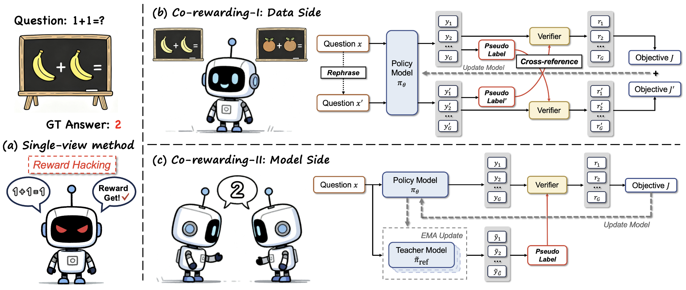

<h1 align="center"><b>[arXiv:2508.00410] "Co-rewarding: Stable Self-supervised RL for Eliciting Reasoning in Large Language Models"</b></h1>

<p align="center">
  <a href="https://arxiv.org/pdf/2508.00410">
    
  </a>
  &nbsp;&nbsp;
  <a href="paper/Co-rewarding.pdf">
    
  </a>
  &nbsp;&nbsp;
  <a href="https://github.com/resistzzz/Co-rewarding/stargazers">
    
  </a>
</p>




**Co-rewarding** is a novel self-supervised RL framework that improves training stability by seeking complementary supervision from another views. Specifically, we instantiate Co-rewarding in two ways: (1) **Co-rewarding-I** is a data-side instantiation that derives reward signals from contrastive agreement across semantically analogous questions; and (2) **Co-rewarding-II** is a model-side instantiation that maintains a slowly-updated reference teacher with pseudo labels to realize self-distillation. Intuitively, such instantiations introduce different levels of discrepancy to increase the difficulty of training collapse on trivial reasoning solutions.


### Install Environment

```bash
# 1. create a new conda environment
conda create -y -n co-rewarding python=3.10
conda activate co-rewarding

# 2. clone the reponsitory
git clone https://github.com/tmlr-group/Co-rewarding.git
cd Co-rewarding

# 3. install necessary package
bash scripts/install_env.sh

# 4. add verl to PYTHONPATH in editable mode
cd Co-rewarding-II
pip install -e . --no-deps
```

### Training Co-rewarding

Set training set, `training_files` and `training_aug_files` for Co-rewarding-I, `training_files` for Co-rewarding-II:
- MATH: `data/math`  
- DAPO-14k: `data/dapo`
- OpenRS: `data/open-rs`

Modify the `WANDB_KEY` and `LLM_PATH` in the `Co-rewarding-I/run_corewarding-I.sh` and `Co-rewarding-I/run_corewarding-I.sh` to your own WANDB key and your downloaded LLMs. then run the following command:

```bash
# Co-rewarding-I
cd Co-rewarding-I
bash run_corewarding-I.sh

# Co-rewarding-II
cd Co-rewarding-II
bash run_corewarding-II.sh
```

### Preprocess the training set

The training datasets, e.g., MATH, DAPO-14k, OpenRS, are provided in the path `Co-rewarding-II/data`, if you want to preprocess from the scatch:

```bash
cd Co-rewarding-II

# MATH
python example/data_preprocess/math_dataset.py

# DAPO-14k
python examples/data_preprocess/dapo17ken_dataset.py

# OpenRS
python example/data_preprocess/open-rs.py
```

If you want to obtain the rephrased data for training Co-rewarding-I:
```
# 1. Copy preprocessed dataset from Co-rewarding-II to Co-rewarding-I
cp -r Co-rewarding-II/data/* Co-rewarding-I/data/

# 2. Rephrase Data
python rewrite_questions.py \
  --input_path data/math/train.parquet \
  --output_jsonl data/math/train_rewrite_Qwen3-32B.jsonl \
  --output_parquet data/math/train_rewrite_Qwen3-32B.parquet \
  --output_original_parquet data/math/train_original.parquet \
  --model_path $YOUR_Qwen3-32B_MODEL_PATH \
  --tokenizer_path $YOUR_Qwen3-32B_TOKENIZER_PATH \
  --question_column prompt \
  --batch_size 128

python rewrite_questions.py \
  --input_path data/dapo/train.parquet \
  --output_jsonl data/dapo/train_rewrite_Qwen3-32B.jsonl \
  --output_parquet data/dapo/train_rewrite_Qwen3-32B.parquet \
  --output_original_parquet data/dapo/train_original.parquet \
  --model_path $YOUR_Qwen3-32B_MODEL_PATH \
  --tokenizer_path $YOUR_Qwen3-32B_TOKENIZER_PATH \
  --question_column prompt \
  --batch_size 128

python rewrite_questions.py \
  --input_path data/open-rs/train.parquet \
  --output_jsonl data/open-rs/train_rewrite_Qwen3-32B.jsonl \
  --output_parquet data/open-rs/train_rewrite_Qwen3-32B.parquet \
  --output_original_parquet data/open-rs/train_original.parquet \
  --model_path $YOUR_Qwen3-32B_MODEL_PATH \
  --tokenizer_path $YOUR_Qwen3-32B_TOKENIZER_PATH \
  --question_column prompt \
  --batch_size 128
```

### Dataset

We release our rephrased dataset:
- Rephrased MATH training set: [TMLR-Group-HF/Co-rewarding-RephrasedMATH](https://huggingface.co/datasets/TMLR-Group-HF/Co-rewarding-RephrasedMATH).
- Rephrased DAPO-14k training set: [TMLR-Group-HF/Co-rewarding-RephrasedDAPO-14k](https://huggingface.co/datasets/TMLR-Group-HF/Co-rewarding-RephrasedDAPO-14k)
- Rephrased OpenRS training set: [TMLR-Group-HF/Co-rewarding-RephrasedOpenRS](https://huggingface.co/datasets/TMLR-Group-HF/Co-rewarding-RephrasedOpenRS)


### Checkpoints

We release all checkpoints trained by us, including our Co-rewarding-I, Co-rewarding-II and all Baselines.

#### Trained on MATH
| Model Name | Model Size | Method | Hugging Face Link |
| --- | --- | --- | --- |
| TMLR-Group-HF/Co-rewarding-I-Qwen2.5-3B-MATH | 3B | Co-rewarding-I | [View Model](https://huggingface.co/TMLR-Group-HF/Co-rewarding-I-Qwen2.5-3B-MATH) |
| TMLR-Group-HF/Co-rewarding-I-Qwen2.5-7B-MATH | 7B | Co-rewarding-I | [View Model](https://huggingface.co/TMLR-Group-HF/Co-rewarding-I-Qwen2.5-7B-MATH) |
| TMLR-Group-HF/Co-rewarding-I-Qwen3-1.7B-Base-MATH | 1.7B | Co-rewarding-I | [View Model](https://huggingface.co/TMLR-Group-HF/Co-rewarding-I-Qwen3-1.7B-Base-MATH) |
| TMLR-Group-HF/Co-rewarding-I-Qwen3-4B-Base-MATH | 4B | Co-rewarding-I | [View Model](https://huggingface.co/TMLR-Group-HF/Co-rewarding-I-Qwen3-4B-Base-MATH) |
| TMLR-Group-HF/Co-rewarding-I-Qwen3-8B-Base-MATH | 8B | Co-rewarding-I | [View Model](https://huggingface.co/TMLR-Group-HF/Co-rewarding-I-Qwen3-8B-Base-MATH) |
| TMLR-Group-HF/Co-rewarding-I-Llama-3.2-3B-Instruct-MATH | 3B | Co-rewarding-I | [View Model](https://huggingface.co/TMLR-Group-HF/Co-rewarding-I-Llama-3.2-3B-Instruct-MATH) |
| --- | --- | --- | --- |
| TMLR-Group-HF/Co-rewarding-II-Qwen2.5-3B-MATH | 3B | Co-rewarding-II | [View Model](https://huggingface.co/TMLR-Group-HF/Co-rewarding-II-Qwen2.5-3B-MATH) |
| TMLR-Group-HF/Co-rewarding-II-Qwen2.5-7B-MATH | 7B | Co-rewarding-II | [View Model](https://huggingface.co/TMLR-Group-HF/Co-rewarding-II-Qwen2.5-7B-MATH) |
| TMLR-Group-HF/Co-rewarding-II-Qwen3-1.7B-Base-MATH | 1.7B | Co-rewarding-II | [View Model](https://huggingface.co/TMLR-Group-HF/Co-rewarding-II-Qwen3-1.7B-Base-MATH) |
| TMLR-Group-HF/Co-rewarding-II-Qwen3-4B-Base-MATH | 4B | Co-rewarding-II | [View Model](https://huggingface.co/TMLR-Group-HF/Co-rewarding-II-Qwen3-4B-Base-MATH) |
| TMLR-Group-HF/Co-rewarding-II-Qwen3-8B-Base-MATH | 8B | Co-rewarding-II | [View Model](https://huggingface.co/TMLR-Group-HF/Co-rewarding-II-Qwen3-8B-Base-MATH) |
| TMLR-Group-HF/Co-rewarding-II-Llama-3.2-3B-Instruct-MATH | 3B | Co-rewarding-II | [View Model](https://huggingface.co/TMLR-Group-HF/Co-rewarding-II-Llama-3.2-3B-Instruct-MATH) |
| --- | --- | --- | --- |
| TMLR-Group-HF/GT-Qwen2.5-3B-MATH | 3B | GT-GRPO | [View Model](https://huggingface.co/TMLR-Group-HF/GT-Qwen2.5-3B-MATH) |
| TMLR-Group-HF/GT-Qwen2.5-7B-MATH | 7B | GT-GRPO | [View Model](https://huggingface.co/TMLR-Group-HF/GT-Qwen2.5-7B-MATH) |
| TMLR-Group-HF/GT-Qwen3-1.7B-Base-MATH | 1.7B | GT-GRPO | [View Model](https://huggingface.co/TMLR-Group-HF/GT-Qwen3-1.7B-Base-MATH) |
| TMLR-Group-HF/GT-Qwen3-4B-Base-MATH | 4B | GT-GRPO | [View Model](https://huggingface.co/TMLR-Group-HF/GT-Qwen3-4B-Base-MATH) |
| TMLR-Group-HF/GT-Qwen3-8B-Base-MATH | 8B | GT-GRPO | [View Model](https://huggingface.co/TMLR-Group-HF/GT-Qwen3-8B-Base-MATH) |
| TMLR-Group-HF/GT-Llama-3.2-3B-Instruct-MATH | 3B | GT-GRPO | [View Model](https://huggingface.co/TMLR-Group-HF/GT-Llama-3.2-3B-Instruct-MATH) |
| --- | --- | --- | --- |
| TMLR-Group-HF/Self-Certainty-Qwen2.5-3B-MATH | 3B | Self-Certainty Maximization | [View Model](https://huggingface.co/TMLR-Group-HF/Self-Certainty-Qwen2.5-3B-MATH) |
| TMLR-Group-HF/Self-Certainty-Qwen2.5-7B-MATH | 7B | Self-Certainty Maximization | [View Model](https://huggingface.co/TMLR-Group-HF/Self-Certainty-Qwen2.5-7B-MATH) |
| TMLR-Group-HF/Self-Certainty-Qwen3-1.7B-Base-MATH | 1.7B | Self-Certainty Maximization | [View Model](https://huggingface.co/TMLR-Group-HF/Self-Certainty-Qwen3-1.7B-Base-MATH) |
| TMLR-Group-HF/Self-Certainty-Qwen3-4B-Base-MATH | 4B | Self-Certainty Maximization | [View Model](https://huggingface.co/TMLR-Group-HF/Self-Certainty-Qwen3-4B-Base-MATH) |
| TMLR-Group-HF/Self-Certainty-Qwen3-8B-Base-MATH | 8B | Self-Certainty Maximization | [View Model](https://huggingface.co/TMLR-Group-HF/Self-Certainty-Qwen3-8B-Base-MATH) |
| TMLR-Group-HF/Self-Certainty-Llama-3.2-3B-Instruct-MATH | 3B | Self-Certainty Maximization | [View Model](https://huggingface.co/TMLR-Group-HF/Self-Certainty-Llama-3.2-3B-Instruct-MATH) |
| --- | --- | --- | --- |
| TMLR-Group-HF/Entropy-Qwen2.5-3B-MATH | 3B | Entropy Minimization | [View Model](https://huggingface.co/TMLR-Group-HF/Entropy-Qwen2.5-3B-MATH) |
| TMLR-Group-HF/Entropy-Qwen2.5-7B-MATH | 7B | Entropy Minimization | [View Model](https://huggingface.co/TMLR-Group-HF/Entropy-Qwen2.5-7B-MATH) |
| TMLR-Group-HF/Entropy-Qwen3-1.7B-Base-MATH | 1.7B | Entropy Minimization | [View Model](https://huggingface.co/TMLR-Group-HF/Entropy-Qwen3-1.7B-Base-MATH) |
| TMLR-Group-HF/Entropy-Qwen3-4B-Base-MATH | 4B | Entropy Minimization | [View Model](https://huggingface.co/TMLR-Group-HF/Entropy-Qwen3-4B-Base-MATH) |
| TMLR-Group-HF/Entropy-Qwen3-8B-Base-MATH | 8B | Entropy Minimization | [View Model](https://huggingface.co/TMLR-Group-HF/Entropy-Qwen3-8B-Base-MATH) |
| TMLR-Group-HF/Entropy-Llama-3.2-3B-Instruct-MATH | 3B | Entropy Minimization | [View Model](https://huggingface.co/TMLR-Group-HF/Entropy-Llama-3.2-3B-Instruct-MATH) |
| --- | --- | --- | --- |
| TMLR-Group-HF/Majority-Voting-Qwen2.5-3B-MATH | 3B | Majority-Voting | [View Model](https://huggingface.co/TMLR-Group-HF/Majority-Voting-Qwen2.5-3B-MATH) |
| TMLR-Group-HF/Majority-Voting-Qwen2.5-7B-MATH | 7B | Majority-Voting | [View Model](https://huggingface.co/TMLR-Group-HF/Majority-Voting-Qwen2.5-7B-MATH) |
| TMLR-Group-HF/Majority-Voting-Qwen3-1.7B-Base-MATH | 1.7B | Majority-Voting | [View Model](https://huggingface.co/TMLR-Group-HF/Majority-Voting-Qwen3-1.7B-Base-MATH) |
| TMLR-Group-HF/Majority-Voting-Qwen3-4B-Base-MATH | 4B | Majority-Voting | [View Model](https://huggingface.co/TMLR-Group-HF/Majority-Voting-Qwen3-4B-Base-MATH) |
| TMLR-Group-HF/Majority-Voting-Qwen3-8B-Base-MATH | 8B | Majority-Voting | [View Model](https://huggingface.co/TMLR-Group-HF/Majority-Voting-Qwen3-8B-Base-MATH) |
| TMLR-Group-HF/Majority-Voting-Llama-3.2-3B-Instruct-MATH | 3B | Majority-Voting | [View Model](https://huggingface.co/TMLR-Group-HF/Majority-Voting-Llama-3.2-3B-Instruct-MATH) |


#### Trained on DAPO-14k
| Model Name | Model Size | Method | Hugging Face Link |
| --- | --- | --- | --- |
| TMLR-Group-HF/Co-rewarding-I-Qwen3-4B-Base-DAPO14k | 4B | Co-rewarding-I | [View Model](https://huggingface.co/TMLR-Group-HF/Co-rewarding-I-Qwen3-4B-Base-DAPO14k) |
| TMLR-Group-HF/Co-rewarding-I-Qwen3-8B-Base-DAPO14k | 8B | Co-rewarding-I | [View Model](https://huggingface.co/TMLR-Group-HF/Co-rewarding-I-Qwen3-8B-Base-DAPO14k) |
| TMLR-Group-HF/Co-rewarding-I-Llama-3.2-3B-Instruct-DAPO14k | 3B | Co-rewarding-I | [View Model](https://huggingface.co/TMLR-Group-HF/Co-rewarding-I-Llama-3.2-3B-Instruct-DAPO14k) |
| --- | --- | --- | --- |
| TMLR-Group-HF/Co-rewarding-II-Qwen3-4B-Base-DAPO14k | 4B | Co-rewarding-II | [View Model](https://huggingface.co/TMLR-Group-HF/Co-rewarding-II-Qwen3-4B-Base-DAPO14k) |
| TMLR-Group-HF/Co-rewarding-II-Qwen3-8B-Base-DAPO14k | 8B | Co-rewarding-II | [View Model](https://huggingface.co/TMLR-Group-HF/Co-rewarding-II-Qwen3-8B-Base-DAPO14k) |
| TMLR-Group-HF/Co-rewarding-II-Llama-3.2-3B-Instruct-DAPO14k | 3B | Co-rewarding-II | [View Model](https://huggingface.co/TMLR-Group-HF/Co-rewarding-II-Llama-3.2-3B-Instruct-DAPO14k) |
| --- | --- | --- | --- |
| TMLR-Group-HF/GT-Qwen3-4B-Base-DAPO14k | 4B | GT-GRPO | [View Model](https://huggingface.co/TMLR-Group-HF/GT-Qwen3-4B-Base-DAPO14k) |
| TMLR-Group-HF/GT-Qwen3-8B-Base-DAPO14k | 8B | GT-GRPO | [View Model](https://huggingface.co/TMLR-Group-HF/GT-Qwen3-8B-Base-DAPO14k) |
| TMLR-Group-HF/GT-Llama-3.2-3B-Instruct-DAPO14k | 3B | GT-GRPO | [View Model](https://huggingface.co/TMLR-Group-HF/GT-Llama-3.2-3B-Instruct-DAPO14k) |
| --- | --- | --- | --- |
| TMLR-Group-HF/Self-Certainty-Qwen3-4B-Base-DAPO14k | 4B | Self-Certainty Maximization | [View Model](https://huggingface.co/TMLR-Group-HF/Self-Certainty-Qwen3-4B-Base-DAPO14k) |
| TMLR-Group-HF/Self-Certainty-Qwen3-8B-Base-DAPO14k | 8B | Self-Certainty Maximization | [View Model](https://huggingface.co/TMLR-Group-HF/Self-Certainty-Qwen3-8B-Base-DAPO14k) |
| TMLR-Group-HF/Self-Certainty-Llama-3.2-3B-Instruct-DAPO14k | 3B | Self-Certainty Maximization | [View Model](https://huggingface.co/TMLR-Group-HF/Self-Certainty-Llama-3.2-3B-Instruct-DAPO14k) |
| --- | --- | --- | --- |
| TMLR-Group-HF/Entropy-Qwen3-4B-Base-DAPO14k | 4B | Entropy Minimization | [View Model](https://huggingface.co/TMLR-Group-HF/Entropy-Qwen3-4B-Base-DAPO14k) |
| TMLR-Group-HF/Entropy-Qwen3-8B-Base-DAPO14k | 8B | Entropy Minimization | [View Model](https://huggingface.co/TMLR-Group-HF/Entropy-Qwen3-8B-Base-DAPO14k) |
| TMLR-Group-HF/Entropy-Llama-3.2-3B-Instruct-DAPO14k | 3B | Entropy Minimization | [View Model](https://huggingface.co/TMLR-Group-HF/Entropy-Llama-3.2-3B-Instruct-DAPO14k) |
| --- | --- | --- | --- |
| TMLR-Group-HF/Majority-Voting-Qwen3-4B-Base-DAPO14k | 4B | Majority-Voting | [View Model](https://huggingface.co/TMLR-Group-HF/Majority-Voting-Qwen3-4B-Base-DAPO14k) |
| TMLR-Group-HF/Majority-Voting-Qwen3-8B-Base-DAPO14k | 8B | Majority-Voting | [View Model](https://huggingface.co/TMLR-Group-HF/Majority-Voting-Qwen3-8B-Base-DAPO14k) |
| TMLR-Group-HF/Majority-Voting-Llama-3.2-3B-Instruct-DAPO14k | 3B | Majority-Voting | [View Model](https://huggingface.co/TMLR-Group-HF/Majority-Voting-Llama-3.2-3B-Instruct-DAPO14k) |


#### Trained on OpenRS
| Model Name | Model Size | Method | Hugging Face Link |
| --- | --- | --- | --- |
| TMLR-Group-HF/Co-rewarding-I-Qwen3-4B-Base-OpenRS | 4B | Co-rewarding-I | [View Model](https://huggingface.co/TMLR-Group-HF/Co-rewarding-I-Qwen3-4B-Base-OpenRS) |
| TMLR-Group-HF/Co-rewarding-I-Qwen3-8B-Base-OpenRS | 8B | Co-rewarding-I | [View Model](https://huggingface.co/TMLR-Group-HF/Co-rewarding-I-Qwen3-8B-Base-OpenRS) |
| --- | --- | --- | --- |
| TMLR-Group-HF/Co-rewarding-II-Qwen3-4B-Base-OpenRS | 4B | Co-rewarding-II | [View Model](https://huggingface.co/TMLR-Group-HF/Co-rewarding-II-Qwen3-4B-Base-OpenRS) |
| TMLR-Group-HF/Co-rewarding-II-Qwen3-8B-Base-OpenRS | 8B | Co-rewarding-II | [View Model](https://huggingface.co/TMLR-Group-HF/Co-rewarding-II-Qwen3-8B-Base-OpenRS) |
| --- | --- | --- | --- |
| TMLR-Group-HF/GT-Qwen3-4B-Base-OpenRS | 4B | GT-GRPO | [View Model](https://huggingface.co/TMLR-Group-HF/GT-Qwen3-4B-Base-OpenRS) |
| TMLR-Group-HF/GT-Qwen3-8B-Base-OpenRS | 8B | GT-GRPO | [View Model](https://huggingface.co/TMLR-Group-HF/GT-Qwen3-8B-Base-OpenRS) |
| --- | --- | --- | --- |
| TMLR-Group-HF/Self-Certainty-Qwen3-4B-Base-OpenRS | 4B | Self-Certainty Maximization | [View Model](https://huggingface.co/TMLR-Group-HF/Self-Certainty-Qwen3-4B-Base-OpenRS) |
| TMLR-Group-HF/Self-Certainty-Qwen3-8B-Base-OpenRS | 8B | Self-Certainty Maximization | [View Model](https://huggingface.co/TMLR-Group-HF/Self-Certainty-Qwen3-8B-Base-OpenRS) |
| --- | --- | --- | --- |
| TMLR-Group-HF/Entropy-Qwen3-4B-Base-OpenRS | 4B | Entropy Minimization | [View Model](https://huggingface.co/TMLR-Group-HF/Entropy-Qwen3-4B-Base-OpenRS) |
| TMLR-Group-HF/Entropy-Qwen3-8B-Base-OpenRS | 8B | Entropy Minimization | [View Model](https://huggingface.co/TMLR-Group-HF/Entropy-Qwen3-8B-Base-OpenRS) |
| --- | --- | --- | --- |
| TMLR-Group-HF/Majority-Voting-Qwen3-4B-Base-OpenRS | 4B | Majority-Voting | [View Model](https://huggingface.co/TMLR-Group-HF/Majority-Voting-Qwen3-4B-Base-OpenRS) |
| TMLR-Group-HF/Majority-Voting-Qwen3-8B-Base-OpenRS | 8B | Majority-Voting | [View Model](https://huggingface.co/TMLR-Group-HF/Majority-Voting-Qwen3-8B-Base-OpenRS) |


## Citation
If you use our datasets or models, please cite our paper!
```
@article{zhang2025co,
  title={Co-rewarding: Stable Self-supervised RL for Eliciting Reasoning in Large Language Models},
  author={Zhang, Zizhuo and Zhu, Jianing and Ge, Xinmu and Zhao, Zihua and Zhou, Zhanke and Li, Xuan and Feng, Xiao and Yao, Jiangchao and Han, Bo},
  journal={arXiv preprint arXiv:2508.00410},
  year={2025}
}
```